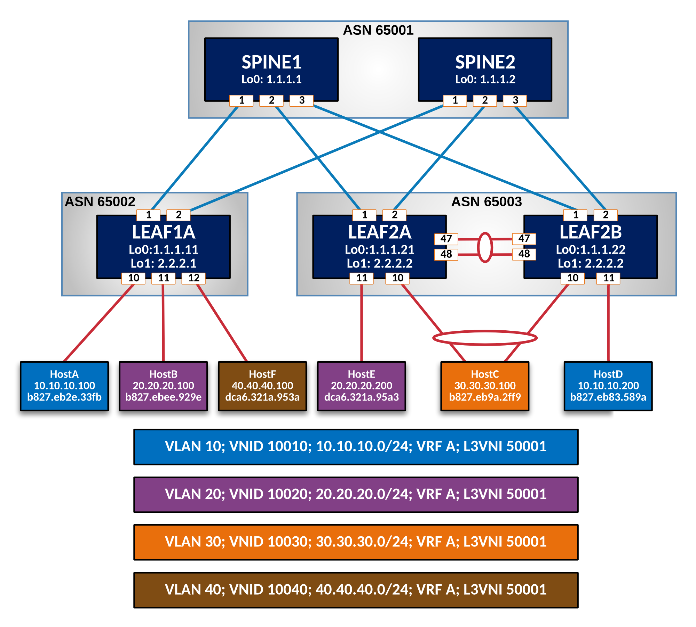

# Webinar: Automating EVPN with Ansible - June 11th, 2020

    

__WARNING:__ EVPN Webinar demo. Work in Progress.

<!-- TOC -->

- [Webinar: Automating EVPN with Ansible - June 11th, 2020](#webinar-automating-evpn-with-ansible---june-11th-2020)
  - [Abstract](#abstract)
  - [Lab Topology](#lab-topology)
  - [Installation and Requirements](#installation-and-requirements)
  - [Additional information](#additional-information)
  - [License](#license)

<!-- /TOC -->

## Abstract

Deploying an EVPN Fabric without any automation at scale can be challenging! By leveraging the Ansible automation framework with the new arista.avd collection, Arista provides a ready to use framework to build EVPN fabrics with consistency. In this webinar, we will take you through the arista.avd collection which includes a set of Ansible roles and modules to help kick-start your automation journey with Arista by applying the best practices prescribed by Arista Validated Designs. Join this webinar to learn how to leverage these roles and how you can customize and extend them to your needs!

Live Demo:

- Network devices and services provisioning directly with Arista EOS eAPI
- Deep-dive into the “stackable template architecture”

## Lab Topology

## Installation and Requirements

Read [Ansible AVD docs](https://github.com/aristanetworks/ansible-avd/blob/devel/README.md) for installation procedure and requirements.

## Additional information

Arista Ansible AVD collection is based on [Arista EVPN Design Guide](https://www.arista.com/en/solutions/design-guides).

## License

Project is published under [Apache License](../../LICENSE).
